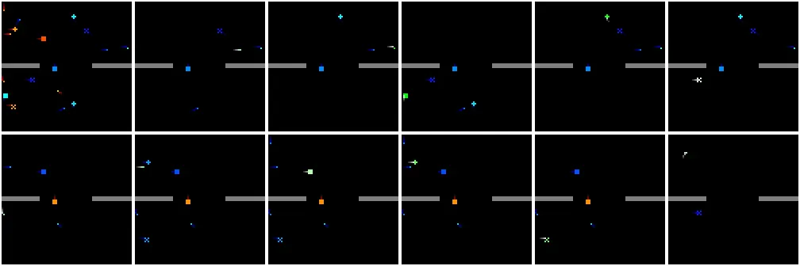

# Gigastep - 1 billion steps per second multi-agent RL

 


  

## 🔽 Installation

```shell
pip3 install gigastep
```
or locally via
```shell
git clone git@github.com:mlech26l/gigastep.git
cd gigastep
pip install -e .
```

To install JAX with GPU support see [JAX installation instructions](https://github.com/google/jax#installation)

Other required packages:
- optax
- flax
- pygame
- opencv-python

## ✨ Features

- Collaborative and adversarial multi-agent  
- Partial observability (stochastic observations and communication)
- 3D dynamics
- Scalable (> 1000 agents, ```jax.jit``` and ```jax.vmap``` support)
- Heterogeneous agent types  


## 🎓 Usage

```python
from gigastep import make_scenario
import jax

env = make_scenario("identical_20_vs_20")
rng = jax.random.PRNGKey(3)
rng, key_reset = jax.random.split(rng, 2)

ep_done = False
state, obs = env.reset(key_reset)
while not ep_done:
    rng, key_action,key_step = jax.random.split(rng, 3)
    action = jax.random.uniform(key_action, shape=(env.n_agents, 3), minval=-1, maxval=1)
    state, obs, rewards, dones, ep_done = env.step(state, action, key_step)
    # obs is an uint8 array of shape [n_agents, 84,84,3]
    # rewards is a float32 array of shape [n_agents]
    # dones is a bool array of shape [n_agents]
    # ep_done is a bool
```


## 🚀 Vectorized Environment 

The ```env.reset``` and ```env.step``` functions are vectorized using ```jax.vmap``` and 
accessible through the ```env.v_reset``` and ```env.v_step``` methods.

```python
from gigastep import make_scenario
import jax
import jax.numpy as jnp

batch_size = 32
env = make_scenario("identical_20_vs_20")
rng = jax.random.PRNGKey(3)
rng, key_reset = jax.random.split(rng, 2)
key_reset = jax.random.split(key_reset, batch_size)

state, obs = env.v_reset(key_reset)
ep_dones = jnp.zeros(batch_size, dtype=jnp.bool_)
while not jnp.all(ep_dones):
    rng, key_action,key_step = jax.random.split(rng, 3)
    action = jax.random.uniform(key_action, shape=(batch_size, env.n_agents, 3), minval=-1, maxval=1)
    key_step = jax.random.split(key_step, batch_size)
    state, obs, rewards, dones, ep_dones = env.v_step(state, action, key_step)
    # obs is an uint8 array of shape [batch_size, n_agents, 84,84,3]
    # rewards is a float32 array of shape [batch_size, n_agents]
    # dones is a bool array of shape [batch_size, n_agents]
    # ep_done is a bool array of shape [batch_size]

    # In case at least one episode is done, reset the state of the done episodes only
    if jnp.any(ep_dones):
        rng, key = jax.random.split(rng, 2)
        states, obs = env.reset_done_episodes(state, obs, ep_dones, key)
```

## 🎭 Scenarios (TODO: define scenarios)

- 🚧 TODO: There should be a list of 10 to 20 built-in scenarios with different agent types and different
The number of agents should be between 2 and 1000
- 🚧 TODO: The ScenarioBuilder should allow defining maps

### List of built-in scenarios

| Scenario                 | Description                                                |
|--------------------------|------------------------------------------------------------|
| ```identical_20_vs_20``` | 20 default units per team                                  |
| ```identical_10_vs_10``` | 10 default units per team                                  |
| ```identical_5_vs_5```   | 5 default units per team                                   |
| ```special_20_vs_20```   | 5 tank, 5 sniper, 5 scout, 5 default units per team        |
| ```special_10_vs_10```   | 3 tank, 3 sniper, 3 scout, 1 default units per team        |
| ```special_5_vs_5```     | 1 tank, 1 sniper, 1 scout, 2 default units per team        |
| **Asymmetric teams**     |                                                            |
| ```identical_20_vs_5```  | 20 default units vs 5 boss units                           |
| ```identical_10_vs_3```  | 10 default units vs 3 boss units                           |
| ```identical_5_vs_1```   | 5 default units vs 1 boss unit                             |
| ```special_20_vs_5```    | 5 tank, 5 sniper, 5 scout, 5 default units vs 5 boss units |
| ```special_10_vs_3```    | 3 tank, 3 sniper, 3 scout, 1 default units vs 3 boss units |
| ```special_5_vs_1```     | 1 tank, 1 sniper, 1 scout, 2 default units vs 1 boss unit  |


### Custom Scenario

```python
from gigastep import ScenarioBuilder

def custom_3v1_scenario():
    builder = ScenarioBuilder()
       
    # add two default type agents to team zero
    builder.add_type(0, "default")
    builder.add_type(0, "default")
    
    # add tank type agent to team zero
    builder.add_type(0, "tank")
    
    # add new agent type with increased health and range to team one 
    builder.add(1,sprite=5, max_health=2, range=2)
    
    return builder.make()

env = custom_3v1_scenario()
assert env.n_agents == 4
```

## 🎬 Visualization (TODO)

🚧 TODO

## 📚 Documentation

🚧 TODO

## 📜 Citation

If you use this code for your research, please cite our paper:

```bibtex
@misc{gigastep2023,
  author = {Gigastep},
  title = {Gigastep: 1 Billion Steps Per Second Multi-Agent Reinforcement Learning},
  year = {2023},
}
```
