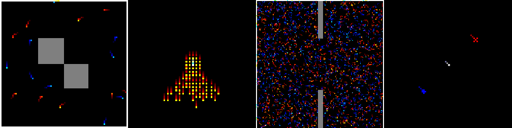

# Gigastep - 1 billion steps per second multi-agent RL

 


  

## 🚧 Update Oct 2023

The following updates will be made over the next few weeks:

- Pool of baseline agents to be added
- Documentation

## 🔽 Installation

```shell
pip3 install gigastep
```
or the latest version via
```shell
pip install git+git@github.com:mlech26l/gigastep.git
```

To install JAX with GPU support see [JAX installation instructions](https://github.com/google/jax#installation)

For training or using the visualizer, you need to install the following packages:

```bash
pip install PIL optax flax chex distrax gymnax pygame
```

## ✨ Features

- Collaborative and adversarial multi-agent  
- Partial observability (stochastic observations and communication)
- 3D dynamics
- Scalable (> 1000 agents, ```jax.jit``` and ```jax.vmap``` support)
- Heterogeneous agent types  



## 🎓 Usage

```python
from gigastep import make_scenario
import jax

env = make_scenario("identical_5_vs_5_fobs_rgb_void_disc")
rng = jax.random.PRNGKey(3)
rng, key_reset = jax.random.split(rng, 2)

ep_done = False
state, obs = env.reset(key_reset)
while not ep_done:
    rng, key_action,key_step = jax.random.split(rng, 3)
    action = jax.random.uniform(key_action, shape=(env.n_agents, 3), minval=-1, maxval=1)
    state, obs, rewards, dones, ep_done = env.step(state, action, key_step)
    # obs is an uint8 array of shape [n_agents, 84,84,3]
    # rewards is a float32 array of shape [n_agents]
    # dones is a bool array of shape [n_agents]
    # ep_done is a bool
```


## 🚀 Vectorized Environment 

The ```env.reset``` and ```env.step``` functions are vectorized using ```jax.vmap``` and 
accessible through the ```env.v_reset``` and ```env.v_step``` methods.

```python
from gigastep import make_scenario
import jax
import jax.numpy as jnp

batch_size = 32
env = make_scenario("identical_5_vs_5_fobs_rgb_void_disc")
rng = jax.random.PRNGKey(3)
rng, key_reset = jax.random.split(rng, 2)
key_reset = jax.random.split(key_reset, batch_size)

state, obs = env.v_reset(key_reset)
ep_dones = jnp.zeros(batch_size, dtype=jnp.bool_)
while not jnp.all(ep_dones):
    rng, key_action,key_step = jax.random.split(rng, 3)
    action = jax.random.uniform(key_action, shape=(batch_size, env.n_agents, 3), minval=-1, maxval=1)
    key_step = jax.random.split(key_step, batch_size)
    state, obs, rewards, dones, ep_dones = env.v_step(state, action, key_step)
    # obs is an uint8 array of shape [batch_size, n_agents, 84,84,3]
    # rewards is a float32 array of shape [batch_size, n_agents]
    # dones is a bool array of shape [batch_size, n_agents]
    # ep_done is a bool array of shape [batch_size]

    # In case at least one episode is done, reset the state of the done episodes only
    if jnp.any(ep_dones):
        rng, key = jax.random.split(rng, 2)
        states, obs = env.reset_done_episodes(state, obs, ep_dones, key)
```

## 🎭 Scenarios 

Gigastep comes with 288 built-in scenarios. Each scenario is defined by the following parameters:

- 4 different objectives ```waypoint```, ```hide_and_seek```, ```identical```, ```special```
- Number of agents for team A and team B (e.g., ```5```, ```10```, ```20```)
- Observability (fully observable ```fobs``` or partially observable ```pobs```)
- Observation type (RGB ```rgb``` or feature vector ```vec```)
- With or without obstacle maps (```void``` or ```maps```)
- Discrete or continuous action space (```disc``` or ```cont```)

An example scenario is ```identical_5_vs_5_fobs_rgb_void_disc```.


To get a full list of all built-in scenarios, use the ```list_scenarios``` function.

```python
from gigastep.scenarios import list_scenarios
for scenario in list_scenarios():
    print(scenario)
```

Here is a selection of scenarios:

| Scenario                    | Description                                     |
|-----------------------------|-------------------------------------------------|
| ```identical_20_vs_20```    | 20 default units per team                       |
| ```identical_5_vs_5```      | 5 default units per team                        |
| ```special_20_vs_5```       | 20 default vs 5 special agents                  |
| ```special_5_vs_3```        | 5 default vs 3 special agents                   |
| ```waypoint_5_vs_5```       | 5 default vs 5 default agents chasing waypoints |
| ```waypoint_5_vs_3```       | 5 default vs 3 faster agents chasing waypoints  |
| ```hide_and_seek_5_vs_5```  | 5 hiding and 5 seeking agent                    |
| ```hide_and_seek_10_vs_5``` | 10 hider and 5 seeking agents                   |


### Custom Scenario

```python
from gigastep import ScenarioBuilder

def custom_3v1_scenario():
    builder = ScenarioBuilder()
       
    # add two default type agents to team zero
    builder.add_type(0, "default")
    builder.add_type(0, "default")
    
    # add agent type with more health to team zero
    builder.add_type(0, "more_health")
    
    # add new agent type with increased health and range to team one 
    builder.add(1,sprite=5, max_health=2, range=2)
    
    return builder.make()

env = custom_3v1_scenario()
assert env.n_agents == 4
```

## 🎬 Visualization

Gigastep comes with a built-in viewer that can be used to visualize the environment.

```python
from gigastep import GigastepViewer, make_scenario
viewer = GigastepViewer(84 * 4) # upscale by 4
env = make_scenario("identical_5_vs_5_fobs_rgb_void_disc")
rng = jax.random.PRNGKey(3)
rng, key_reset = jax.random.split(rng, 2)

ep_done = False
state, obs = env.reset(key_reset)
while not ep_done:
    rng, key_action,key_step = jax.random.split(rng, 3)
    action = jax.random.uniform(key_action, shape=(env.n_agents, 3), minval=-1, maxval=1)
    state, obs, rewards, dones, ep_done = env.step(state, action, key_step)
    viewer.draw(env, state, obs)
```

The viewer visualized the global information (e.g., the map, the waypoints, the agents).
If the environment uses the RGB observation type, the viewer can also visualize the RGB observations by 
passing the ```show_num_agents=N``` argument of the viewer's initialization function (where N is the number of agents to visualize).

## 📚 Documentation

🚧 TODO

## 📜 Citation

If you use this benchmark please cite our paper:

```bibtex
@inproceedings{lechner2023gigastep,
    author={Mathias Lechner and Lianhao Yin and Tim Seyde and Tsun-Hsuan Wang and Wei Xiao and Ramin Hasani and Joshua Rountree and Daniela Rus},
    title={Gigastep - One Billion Steps per Second Multi-agent Reinforcement Learning},
    booktitle={Advances in Neural Information Processing Systems},
    year={2023},
    url={https://openreview.net/forum?id=UgPAaEugH3}
}
```

## Acknowledgements

Research was sponsored by the United States Air Force Research Laboratory 
and the United States Air Force Artificial Intelligence Accelerator and was 
accomplished under Cooperative Agreement Number FA8750-19-2-1000. 
The views and conclusions contained in this document are those of the authors 
and should not be interpreted as representing the official policies, 
either expressed or implied, of the United States Air Force or the U.S. Government. 
The U.S. Government is authorized to reproduce and distribute reprints for 
Government purposes notwithstanding any copyright notation herein. 
The research was also funded in part by the AI2050 program at Schmidt Futures (Grant G-22-63172) and Capgemini SE.
